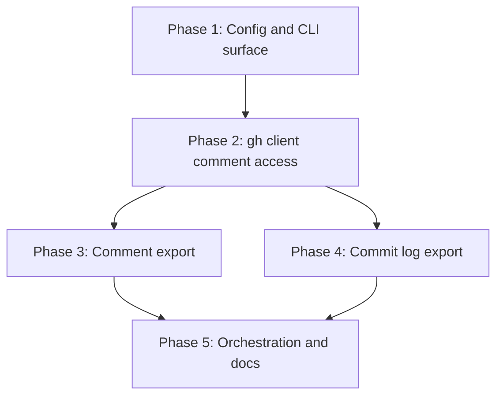

# Implementation Plan: Export PR Comments and Commit Log

## Overview

Five phases. Phase 1 opens the config and CLI surface so later phases have somewhere to hang behaviour. Phase 2 adds the GitHub access - three REST comment calls and one GraphQL review-thread call. Phases 3 and 4 add the two exporters and can run in parallel once Phase 2 lands. Phase 5 wires all four modes into `main` and updates the documentation.

## Affected Files

| File | Change Type | Description |
| ---- | ----------- | ----------- |
| src/prinfo/cli.py | Update | Two new flags; `main` orchestrates four export modes with per-mode error isolation |
| src/prinfo/config.py | Update | `export_comments` and `export_commit_log` on `AppConfig`; two env keys; relaxed `--skip-check-logs` guard |
| src/prinfo/gh.py | Update | `IssueComment`, `ReviewComment`, `PullRequestReview`, `ReviewThread` dataclasses; three REST methods; one GraphQL method; `_run_graphql_paginated` |
| src/prinfo/exporter.py | Update | `export_pr_comments` and `export_pr_commit_log`; shared commit fetch; Markdown renderer; result dataclasses |
| `src/prinfo/__init__.py` | Update | Version bump to 0.4.0 |
| tests/test_gh.py | Update | Parser tests for the four new client methods |
| tests/test_config.py | Update | Flag and env resolution, relaxed guard |
| tests/test_cli.py | Update | Parser acceptance, `main` exit codes across four modes |
| tests/test_exporter.py | Update | Both new exporters, thread mapping, failure isolation |
| README.md | Update | Flags, env keys, output files, relaxed skip rule |
| skills/prinfo/SKILL.md | Update | New modes in the skill overview |
| skills/prinfo/references/commands.md | Update | Command recipes for both flags |
| skills/prinfo/references/outputs.md | Update | `comments.json`, `comments.md`, `commit-log.json` shapes |

## Phase 1: Config and CLI surface

Requirements: REQ-5

### Implementation Work - Phase 1

- In `src/prinfo/config.py`, add `export_comments: bool` and `export_commit_log: bool` to `AppConfig` after `export_commit_files`.
- In `resolve_config`, resolve both through `_resolve_bool` against `PRINFO_EXPORT_COMMENTS` and `PRINFO_EXPORT_COMMIT_LOG`, mirroring the `export_commit_files` block.
- Replace the guard at `src/prinfo/config.py:52` with one that raises only when `skip_check_logs` is set and none of `export_commit_files`, `export_comments`, `export_commit_log` is. Rewrite the message to name all three flags and all three env keys.
- In `src/prinfo/cli.py`, add `--export-comments` and `--export-commit-log` as `store_true` arguments with help text describing what each writes.

### Test Work - Phase 1

- `tests/test_config.py`: both flags default to `False`; each resolves `True` from its env key; a set CLI flag beats an env value of `false`.
- `tests/test_config.py`: `--skip-check-logs` accepted with `export_comments` alone, with `export_commit_log` alone, and with `export_commit_files` alone; rejected with none set, asserting the message mentions all three flags.
- `tests/test_cli.py`: `build_parser` parses each new flag and both together.

### Verification - Phase 1

- `uv run pytest tests/test_config.py tests/test_cli.py` - all pass.
- `uv run prinfo --help` lists both new flags.

## Phase 2: gh client comment access

Requirements: REQ-1, REQ-7

### Implementation Work - Phase 2

- In `src/prinfo/gh.py`, add frozen dataclasses `IssueComment`, `ReviewComment`, `PullRequestReview` and `ReviewThread` with the fields listed in REQ-1 and REQ-7. `ReviewComment` carries `is_resolved: bool | None` and `thread_id: str | None`, both defaulting to `None` so the exporter can attach thread state without a second type.
- Add `_parse_issue_comment`, `_parse_review_comment` and `_parse_review` module-level functions following `_parse_pr_commit`: raise `GhCliError` naming the endpoint when the entry is not an object or the id is missing, resolve absent optional fields to `None`, and tolerate a missing `user` object by setting `author=None` and `author_type=None`.
- Add `list_pr_issue_comments`, `list_pr_review_comments` and `list_pr_reviews`, each parsing the repo through `parse_repo_ref`, building the endpoint path and calling `_run_paginated_json(host=repo_ref.host, endpoint=...)`.
- Add `_run_graphql_paginated(self, *, host, query, variables)` building `gh api graphql --hostname <host> --paginate -f query=<query> -F <k>=<v> ...`, then parsing the response. Decide `--slurp` versus concatenated-document parsing from what the fake-runner test shows the parser must accept, and handle both a single document and a list of documents.
- Add `list_pr_review_threads(repo, pr_number)` issuing the `repository.pullRequest.reviewThreads` query with `$owner`, `$name`, `$number`, `$endCursor`, selecting `pageInfo { hasNextPage endCursor }` and per node `id`, `isResolved`, `isOutdated`, `comments(first: 100) { nodes { databaseId } }`. Return `ReviewThread` records with `comment_ids` taken from `databaseId`.

### Test Work - Phase 2

- `tests/test_gh.py`: one parse test per REST method over a two-page fake payload, asserting every documented field including `diff_hunk` and `in_reply_to_id`.
- `tests/test_gh.py`: a comment entry that is not an object raises `GhCliError` and the message names the endpoint.
- `tests/test_gh.py`: an entry with no `user` key yields `author=None` rather than raising.
- `tests/test_gh.py`: a paginated GraphQL payload parses into `ReviewThread` records with `comment_ids` populated from `databaseId`.
- `tests/test_gh.py`: an enterprise repo reference puts the right value after `--hostname` in the GraphQL argument vector.

### Verification - Phase 2

- `uv run pytest tests/test_gh.py` - all pass.
- `uv run ruff check src tests` - clean.

## Phase 3: Comment export

Requirements: REQ-2, REQ-3, REQ-6, REQ-7

### Implementation Work - Phase 3

- In `src/prinfo/exporter.py`, add a frozen `CommentExportResult` (repo, pr_number, output_dir, manifest_path, transcript_path, per-source counts, skipped_sources count) beside the existing result dataclasses.
- Add `export_pr_comments(config, gh)`: call `gh.ensure_available()`, resolve the repo the same way `export_pr_check_logs` does, then call the four client methods each inside its own `try`, appending a `_skipped_source_record(source, reason, reason_code)` on `GhCliError` and continuing. Raise `ExportError` naming the PR when every source failed.
- Build `dict[int, ReviewThread]` from the thread records and use `dataclasses.replace` to set `is_resolved` and `thread_id` on each matching `ReviewComment`.
- Write `comments.json` with `repo`, `pr_number`, `issue_comments`, `review_comments`, `reviews`, `review_threads`, `counts`, `skipped_sources`, serializing records through `asdict` and `json.dumps(..., indent=2)` with `encoding="utf-8"`.
- Add `_render_comments_markdown(...)` returning the transcript string: title line, then entries sorted by `(timestamp is None, timestamp or "")`, each with a heading naming author, source kind, timestamp, review state for reviews, and `path` plus line and resolved state for inline comments, followed by the verbatim body. Write it to `comments.md` with `encoding="utf-8"`.

### Test Work - Phase 3

- `tests/test_exporter.py`: a fake gh returning records from all four sources produces `comments.json` with every record and correct per-source `counts` (AC-2).
- `tests/test_exporter.py`: `comments.md` sections appear in timestamp order and an entry with `created_at=None` is last (AC-3).
- `tests/test_exporter.py`: a fake whose `list_pr_reviews` raises `GhCliError` still exports the other sources and records `reviews` under `skipped_sources` with a `reason_code` (AC-7).
- `tests/test_exporter.py`: a fake whose every source raises produces `ExportError` (AC-7).
- `tests/test_exporter.py`: a thread whose `comment_ids` matches one review comment sets `is_resolved` and `thread_id` on it and leaves an unmatched comment at `None` (AC-9).
- `tests/test_exporter.py`: a fake whose `list_pr_review_threads` raises records `review_threads` under `skipped_sources` while all three REST sources still appear (AC-10).

### Verification - Phase 3

- `uv run pytest tests/test_exporter.py` - all pass.
- Inspect a generated `comments.md` from the test tmp path and confirm no absolute path and no non-ASCII character was introduced by the renderer itself.

## Phase 4: Commit log export

Requirements: REQ-4

### Implementation Work - Phase 4

- In `src/prinfo/exporter.py`, add a frozen `CommitLogExportResult` (repo, pr_number, output_dir, manifest_path, commit_count).
- Add a small commit-list cache so the commits endpoint is called once per run: a `_PrCommitCache` holding the fetched list keyed by nothing more than its own instance, created in `main` and passed to both commit-facing exporters, with `export_pr_commit_files` reading from it instead of calling `gh.list_pr_commits` directly.
- Add `export_pr_commit_log(config, gh, commits=None)`: take the commits from the cache when present, otherwise fetch them, then write `commit-log.json` with `repo`, `pr_number`, `commit_count` and `commits` as `asdict` records. Download nothing.
- Leave `commits-manifest.json` and `commits/<sha>/_commit.json` writing untouched.

### Test Work - Phase 4

- `tests/test_exporter.py`: `export_pr_commit_log` alone writes `commit-log.json` with the full `PrCommit` fields and the fake's `download_commit_file` is never called (AC-4).
- `tests/test_exporter.py`: with both commit modes run through the shared cache, a counting fake records exactly one `list_pr_commits` call and both `commit-log.json` and `commits-manifest.json` exist (AC-4).
- `tests/test_exporter.py`: existing commit-file export assertions still pass unchanged, proving `commits-manifest.json` did not change shape.

### Verification - Phase 4

- `uv run pytest tests/test_exporter.py` - all pass, including the pre-existing commit-export tests.

## Phase 5: Orchestration and docs

Requirements: REQ-6, REQ-8

### Implementation Work - Phase 5

- In `src/prinfo/cli.py`, replace the four parallel result and error variables with a list of per-mode records (`name`, `result`, `error`), one per requested mode, so adding the two new modes does not add four more locals.
- Run each requested mode in its own `try`, catching `ExportError` and recording it. Raise only when no mode produced a result, preferring the first recorded error for the message.
- Log a per-mode summary as today: counts for check logs, commit files, comments (per source plus skipped sources) and commit log.
- Bump `__version__` to `0.4.0` in `src/prinfo/__init__.py`.
- Update `README.md`: quick-start examples for both flags, both env keys in the supported list, the three new output files under `## Output`, and the relaxed `--skip-check-logs` sentence.
- Update `skills/prinfo/SKILL.md`, `skills/prinfo/references/commands.md` and `skills/prinfo/references/outputs.md` to describe the new modes and their outputs.

### Test Work - Phase 5

- `tests/test_cli.py`: `main` with comments and commit-log requested, where comments fails and commit log succeeds, returns 0 and logs the failure at warning (AC-8).
- `tests/test_cli.py`: `main` where every requested mode fails returns 1 (AC-8).
- `tests/test_cli.py`: `--version` reports `0.4.0`.

### Verification - Phase 5

- `uv run pytest` - full suite passes.
- `uv run ruff check .` - clean.
- `markdownlint-cli2 "**/*.md" "#node_modules"` - clean (AC-11).
- `uv run prinfo --help` on Windows shows both flags, matching the CI help smoke test.

## Traceability

| REQ | Phase | Acceptance Criteria |
| --- | ----- | ------------------- |
| REQ-1 | Phase 2 | AC-1, AC-12 |
| REQ-2 | Phase 3 | AC-2, AC-12 |
| REQ-3 | Phase 3 | AC-3, AC-12 |
| REQ-4 | Phase 4 | AC-4, AC-12 |
| REQ-5 | Phase 1 | AC-5, AC-6, AC-12 |
| REQ-6 | Phase 3, Phase 5 | AC-7, AC-8, AC-12 |
| REQ-7 | Phase 2, Phase 3 | AC-9, AC-10, AC-12 |
| REQ-8 | Phase 5 | AC-11 |

## Dependency Graph

Phase 3 and Phase 4 have no dependency on each other and can be implemented in parallel once Phase 2 is merged.

## Estimated Scope

| Phase | Source Files | Test Files | Effort |
| ----- | ------------ | ---------- | ------ |
| Phase 1: Config and CLI surface | 2 | 2 | Small |
| Phase 2: gh client comment access | 1 | 1 | Large |
| Phase 3: Comment export | 1 | 1 | Large |
| Phase 4: Commit log export | 1 | 1 | Medium |
| Phase 5: Orchestration and docs | 3 | 1 | Medium |
