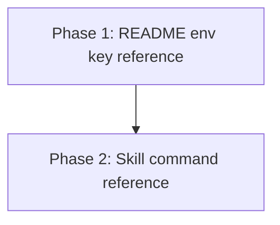

# Implementation Plan: Document Every PRINFO Env Key

## Overview

Two phases, one per document. Phase 1 fixes `README.md`, which is the reference a human reads. Phase
2 applies the same correction to `skills/prinfo/references/commands.md`, which an agent reads on its
own. The phases touch different files and share no code, so Phase 2 depends on Phase 1 only for the
wording settled there, which it reuses rather than reinvents.



## Affected Files

| File | Change Type | Description |
| ---- | ----------- | ----------- |
| README.md | Update | Sync the supported-env-keys list, say the keys come from the env file, add a `PRINFO_ENV_FILE` subsection |
| skills/prinfo/references/commands.md | Update | Same three corrections, keeping the list self-contained and the `--skip-empty-logs` sentence |

## Phase 1: README env key reference

Requirements: REQ-1, REQ-3, REQ-4

### Implementation Work - Phase 1

- Derive the authoritative key set first: read `src/prinfo/config.py` and collect every key passed to
  `env_values.get(...)` inside `resolve_config`. Ignore the `PRINFO_*` names inside the
  `--skip-check-logs` error message, which are message text rather than lookups.
- In `README.md`, compare that set against the bullets under `Supported env keys:` and add any key
  the list is missing, appended in the order the resolver reads them. Remove any bullet naming a key
  the resolver does not read.
- Retitle the list lead-in so it states the keys are read from the env file, for example
  `Supported env-file keys:`, and add one sentence saying these keys are read from the env file and
  not from exported shell variables (REQ-4).
- Add a subsection immediately after the list covering `PRINFO_ENV_FILE` (REQ-3). It must say the key
  is read from the process environment rather than the env file, that it names the env file the
  listed keys are read from and so cannot be set inside it, that `--env-file` takes precedence when
  both are given, and that `prinfo` falls back to a `.env` file in the current directory when neither
  is given. Check each clause against `_resolve_env_file` (`src/prinfo/config.py:92-102`) before
  writing it.
- Keep the existing `CLI arguments override env-file values.` sentence.
- Give the new subsection a heading text that appears nowhere else in `README.md` (MD024).

### Test Work - Phase 1

- No automated test. The drift guard was declined in Q3 of `open_questions.md` and is recorded under
  `## Non-Requirements` in `PRD.md`.
- The check that stands in for a test is the derived-set comparison in the verification step below,
  which must be run against `src/prinfo/config.py` and not against the table in `PRD.md`.

### Verification - Phase 1

```bash
markdownlint-cli2 "**/*.md" "#node_modules"
```

Expected: no findings (AC-5).

Re-derive the key set and compare it to the list, failing the phase on any difference:

```bash
uv run python -c "import re,pathlib; cfg=pathlib.Path('src/prinfo/config.py').read_text(encoding='utf-8'); code=set(re.findall(r'env_values\.get\(\"(PRINFO_[A-Z_]+)\"', cfg)); doc=set(re.findall(r'PRINFO_[A-Z_]+', pathlib.Path('README.md').read_text(encoding='utf-8'))); print('missing from README:', sorted(code-doc)); print('in README only:', sorted(doc-code-{'PRINFO_ENV_FILE'}))"
```

Expected: both lists print empty (AC-1).

Read `src/prinfo/config.py:92-102` and confirm every clause of the new subsection matches
`_resolve_env_file` (AC-3), and that the list lead-in states the env-file origin (AC-4).

## Phase 2: Skill command reference

Requirements: REQ-2, REQ-3, REQ-4

### Implementation Work - Phase 2

- In `skills/prinfo/references/commands.md`, bring the bullets under `Supported keys:` to the same
  set derived in Phase 1, appending the missing keys rather than re-sorting the list.
- Keep the list in this file rather than pointing at `README.md`, per Q4 of `open_questions.md`.
- Keep the sentence saying there is currently no env-file key for `--skip-empty-logs` - it is accurate
  against `src/prinfo/config.py:46` and easy to lose while rewriting the surrounding block.
- Keep `Remember that explicit CLI flags override values from the env file.`
- Add the same env-file-origin sentence as Phase 1 (REQ-4) and the same `PRINFO_ENV_FILE` coverage
  (REQ-3), reusing Phase 1's wording so the two documents cannot disagree.
- The file already has a heading `## Environment file driven run`, so the new content needs either a
  distinct heading text or no heading of its own (MD024).

### Test Work - Phase 2

- No automated test, for the reason given in Phase 1.

### Verification - Phase 2

```bash
markdownlint-cli2 "**/*.md" "#node_modules"
```

Expected: no findings (AC-5).

```bash
uv run python -c "import re,pathlib; cfg=pathlib.Path('src/prinfo/config.py').read_text(encoding='utf-8'); code=set(re.findall(r'env_values\.get\(\"(PRINFO_[A-Z_]+)\"', cfg)); doc=set(re.findall(r'PRINFO_[A-Z_]+', pathlib.Path('skills/prinfo/references/commands.md').read_text(encoding='utf-8'))); print('missing from commands.md:', sorted(code-doc))"
```

Expected: prints an empty list (AC-2).

```bash
grep -c "skip-empty-logs" skills/prinfo/references/commands.md
```

Expected: at least 1, proving the sentence survived (AC-2).

## Traceability

| REQ | Phase | Acceptance Criteria |
| --- | ----- | ------------------- |
| REQ-1 | Phase 1 | AC-1, AC-5, AC-6 |
| REQ-2 | Phase 2 | AC-2, AC-5, AC-6 |
| REQ-3 | Phase 1, Phase 2 | AC-3, AC-5, AC-6 |
| REQ-4 | Phase 1, Phase 2 | AC-4, AC-5, AC-6 |

## Dependency Graph


Phase 2 reuses the wording and the derived key set settled in Phase 1, so the two are done in order
rather than in parallel.

## Estimated Scope

| Phase | Source Files | Test Files | Effort |
| ----- | ------------ | ---------- | ------ |
| Phase 1: README env key reference | 1 | 0 | Small |
| Phase 2: Skill command reference | 1 | 0 | Small |
