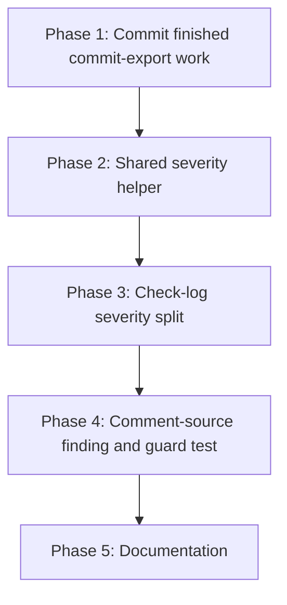

# Implementation Plan: Skip Reason Severity Reporting

## Overview

Five phases. Phase 1 commits the already-finished commit-export work
(REQ-1, REQ-2) as its own commit, closing the two numbered defects in
issue #3 before the remaining work builds on top. Phase 2 extracts the shared
severity helper (REQ-5) using the existing commit-file branch as its only
caller, a pure refactor. Phase 3 adds the check-log severity split, both the
summary breakdown and the per-item log level change (REQ-3, REQ-4), and
becomes the helper's second caller. Phase 4 adds the comment-source finding
and its guard test with no production code change (REQ-6). Phase 5 updates
the documentation (REQ-7).

## Affected Files

| File | Change Type | Description |
| ---- | ----------- | ----------- |
| src/prinfo/exporter.py | Update | Add `ACTIONABLE_CHECK_SKIP_REASONS`, `skipped_check_reasons` breakdown on `ExportResult`, per-item log level change for `unsupported_check_type` |
| src/prinfo/cli.py | Update | Extract `_log_skip_severity`; route the commit-file branch through it in Phase 2 and the check-log branch through it in Phase 3 |
| tests/test_exporter.py | Update | Check-log breakdown and per-item log-level tests; comment-source guard test |
| tests/test_cli.py | Update | Check-log summary WARNING/INFO split test; shared-helper call-site test |
| README.md | Update | Document the check-log severity split |
| skills/prinfo/references/outputs.md | Update | Extend "How to explain skipped checks" with the actionable/benign split |

## Phase 1: Commit finished commit-export work

Requirements: REQ-1, REQ-2

### Implementation Work - Phase 1

- No source change. The working tree on `fix/commit-skip-reasons-repro`
  already carries the finished commit-export fix: `_CommitFolderResult`
  embedding `skipped` into `commits-manifest.json` records (REQ-1),
  `CommitExportResult.skipped_file_reasons`, `ACTIONABLE_COMMIT_SKIP_REASONS`
  and the WARNING/INFO split in `src/prinfo/cli.py:195-207` (REQ-2), the four
  supporting tests, and the doc updates for the commit-file skip-reason
  sections in `README.md` and `skills/prinfo/references/outputs.md`.
- Stage `src/prinfo/exporter.py`, `src/prinfo/cli.py`, `tests/test_exporter.py`,
  `tests/test_cli.py`, `README.md` and `skills/prinfo/references/outputs.md`
  and commit them as one commit closing the two numbered defects in issue #3,
  per Q6.

### Test Work - Phase 1

- No new tests. The four existing commit-export tests already cover REQ-1
  and REQ-2 and are included in the commit unchanged.

### Verification - Phase 1

- `uv run pytest` - all 76 pre-existing tests pass.
- `uv run ruff check src tests` - clean.
- `npx pyright src/prinfo/exporter.py src/prinfo/cli.py` - 0 errors.
- `npx markdownlint-cli2 "**/*.md" "#node_modules"` - clean.
- `git status` shows a clean working tree for the six files above after the
  commit.

## Phase 2: Shared severity helper

Requirements: REQ-5

### Implementation Work - Phase 2

- In `src/prinfo/cli.py`, add `_log_skip_severity(logger, *, total, breakdown,
  actionable_reasons, actionable_message, benign_message)`: compute
  `actionable = sum(count for code, count in breakdown.items() if code in
  actionable_reasons)` and `benign = total - actionable`; log
  `logger.warning(actionable_message, actionable)` when `actionable` is
  non-zero and `logger.info(benign_message, benign)` when `benign` is
  non-zero; do nothing when `total` is zero.
- Replace the inline actionable/benign computation in the `CommitExportResult`
  branch of `_log_mode_summaries` (`src/prinfo/cli.py:195-207`) with a call to
  `_log_skip_severity`, passing `result.skipped_files`,
  `result.skipped_file_reasons`, `ACTIONABLE_COMMIT_SKIP_REASONS`, and the two
  message strings already in use, unchanged.
- No behaviour change: this phase is a pure refactor of the commit-file
  branch, validated by the existing four commit-file tests passing with no
  edits.

### Test Work - Phase 2

- Confirm the four existing commit-file severity tests
  (`tests/test_cli.py`) pass unchanged against the refactored code, proving
  the extraction preserved behaviour.
- Add one direct unit test for `_log_skip_severity` in `tests/test_cli.py`:
  a mixed breakdown produces both the WARNING and the INFO call; a
  breakdown with only actionable counts produces only the WARNING; a
  breakdown with only benign counts produces only the INFO; a zero total
  produces neither.

### Verification - Phase 2

- `uv run pytest tests/test_cli.py` - all pass, including the four
  pre-existing commit-file severity tests with no changes to their assertions.
- `uv run ruff check src tests` - clean.

## Phase 3: Check-log severity split

Requirements: REQ-3, REQ-4

### Implementation Work - Phase 3

- In `src/prinfo/exporter.py`, add
  `ACTIONABLE_CHECK_SKIP_REASONS = frozenset({"missing_log_content"})` beside
  `ACTIONABLE_COMMIT_SKIP_REASONS`, with the same style of comment explaining
  which reason code is benign and which is actionable.
- Add `skipped_check_reasons: Mapping[str, int] = field(default_factory=dict)`
  to `ExportResult`.
- In `export_pr_check_logs`, build `skipped_check_reasons` with
  `collections.Counter` over the `reason_code` of each entry appended to
  `skipped`, and pass it into the returned `ExportResult`.
- Change the `unsupported_check_type` branch's `LOGGER.warning` at
  `src/prinfo/exporter.py:119` to `LOGGER.info`, keeping the same message
  text. Leave the `missing_log_content` branch's `LOGGER.warning` at `:135`
  unchanged.
- In `src/prinfo/cli.py`, replace the `ExportResult` branch's
  `if result.skipped_checks: logger.warning("Skipped %s check(s).", ...)`
  (`:167-168`) with a call to `_log_skip_severity`, passing
  `result.skipped_checks`, `result.skipped_check_reasons`,
  `ACTIONABLE_CHECK_SKIP_REASONS`, and two new message strings:
  `"%s check(s) could not produce a log."` for the actionable case and
  `"%s check(s) are not GitHub Actions jobs and were skipped."` for the
  benign case.

### Test Work - Phase 3

- `tests/test_exporter.py`: a check-log export mixing `missing_log_content`
  and `unsupported_check_type` skips produces the correct
  `skipped_check_reasons` breakdown (AC-3).
- `tests/test_exporter.py`: `caplog` asserts an `unsupported_check_type` skip
  logs at INFO and a `missing_log_content` skip logs at WARNING, each at the
  per-item call site (AC-4).
- `tests/test_cli.py`: a check-log result mixing both reason codes produces
  exactly one WARNING naming the actionable count and one INFO naming the
  benign count, via `_log_skip_severity` (AC-3).
- `tests/test_cli.py`: a check-log result with only `unsupported_check_type`
  skips produces no WARNING, only the INFO line, proving the benign-only path
  no longer warns (AC-3, regression against the issue's repro).

### Verification - Phase 3

- `uv run pytest tests/test_exporter.py tests/test_cli.py` - all pass.
- `uv run ruff check src tests` - clean.
- `npx pyright src/prinfo/exporter.py src/prinfo/cli.py` - 0 errors.
- Manual repro check: a fake check-log export with only
  `unsupported_check_type` skips no longer produces a WARNING line in
  `caplog`, matching the issue's repro but for check logs instead of commit
  files.

## Phase 4: Comment-source finding and guard test

Requirements: REQ-6

### Implementation Work - Phase 4

- No production code change to `export_pr_comments` or to the
  `skipped_sources` branch of `_log_mode_summaries`
  (`src/prinfo/cli.py:181-185`). The finding recorded in `analysis.md` is the
  deliverable: all four comment-source call sites emit only
  `source_unavailable`, which is always actionable, so the existing
  unconditional warning already matches the desired behaviour and there is no
  benign branch to route to INFO.

### Test Work - Phase 4

- `tests/test_exporter.py`: drive `export_pr_comments` with a fake `GhCli`
  whose `list_pr_issue_comments`, `list_pr_review_comments`, `list_pr_reviews`
  and `list_pr_review_threads` each raise `GhCliError`, and assert every
  `reason_code` recorded in the result's `skipped_sources` equals
  `"source_unavailable"`. This pins the finding: the test fails the moment a
  future change introduces a second comment-source reason code without also
  reopening this task's conclusion.

### Verification - Phase 4

- `uv run pytest tests/test_exporter.py -k comments` - the new guard test
  passes alongside the existing comment-export tests.
- `git diff src/prinfo/exporter.py src/prinfo/cli.py` shows no change from
  the end of Phase 3, confirming REQ-6 added no production code.

## Phase 5: Documentation

Requirements: REQ-7

### Implementation Work - Phase 5

- In `README.md`, extend the `## Output` section's check-log paragraph (or
  add a new paragraph beside the existing commit-file skip-reason paragraph
  added in Phase 1) describing the check-log severity split: the actionable
  reason code `missing_log_content` warns, the benign reason code
  `unsupported_check_type` logs at INFO, matching the wording style already
  used for the commit-file split.
- In `skills/prinfo/references/outputs.md`, extend the existing
  `## How to explain skipped checks` section with the actionable/benign
  classification, following the structure of the existing
  `## How to explain a skipped commit file` section: name each `reason_code`,
  say whether it is normal or worth investigating, and note the per-item
  log-level change from Phase 3.

### Test Work - Phase 5

- No automated test beyond the Markdown linter. Every reason code and log
  level named in the docs is checked by hand against
  `src/prinfo/exporter.py` so the docs cannot drift from the code this task
  changed.

### Verification - Phase 5

- `npx markdownlint-cli2 "**/*.md" "#node_modules"` - clean.
- Manual cross-check: every reason code and log level named in `README.md`
  and `skills/prinfo/references/outputs.md` matches
  `ACTIONABLE_CHECK_SKIP_REASONS` and the per-item log levels in
  `src/prinfo/exporter.py`.

## Traceability

| REQ | Phase | Acceptance Criteria |
| --- | ----- | -------------------- |
| REQ-1 | Phase 1 | AC-1, AC-8, AC-9 |
| REQ-2 | Phase 1 | AC-2, AC-8, AC-9 |
| REQ-3 | Phase 3 | AC-3, AC-8, AC-9 |
| REQ-4 | Phase 3 | AC-4, AC-8, AC-9 |
| REQ-5 | Phase 2 | AC-5, AC-8, AC-9 |
| REQ-6 | Phase 4 | AC-6, AC-8, AC-9 |
| REQ-7 | Phase 5 | AC-7 |

## Dependency Graph

Every phase depends on the one before it: Phase 2 needs Phase 1's commit as
its base, Phase 3 needs Phase 2's helper to call, Phase 4 needs Phase 3
finished so the whole check-log split is in place before the comment-source
comparison is drawn, and Phase 5 documents the finished behaviour of Phases
1 through 4.

## Estimated Scope

| Phase | Source Files | Test Files | Effort |
| ----- | ------------ | ---------- | ------ |
| Phase 1: Commit finished commit-export work | 2 | 2 | Small |
| Phase 2: Shared severity helper | 1 | 1 | Small |
| Phase 3: Check-log severity split | 2 | 2 | Medium |
| Phase 4: Comment-source finding and guard test | 0 | 1 | Small |
| Phase 5: Documentation | 2 | 0 | Small |
